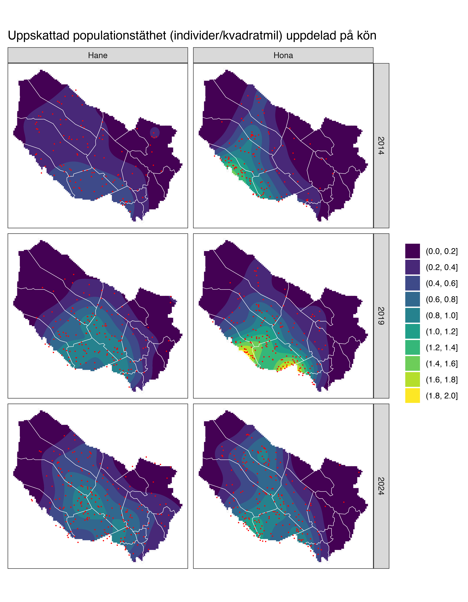

Spillningsinventering björn, Västerbottens län 2024
================

Detta bibliotek innehåller programkod och data som använts för
populationsberäkningar av björn, baserade på spillningsinventeringen i
Västerbottens län 2024. Vid tidigare inventeringar har
populationsberäkningen avsett antalet individer *före* genomförd
licensjakt. Enligt instruktion från Naturvårdsverket ska denna
inventering i stället avse antalet individer *efter* genomförd
licensjakt. Detta uppnås genom att spillningsprover från individer som
bekräftats fällda inte inkluderas i beräkningsunderlaget. På motsvarande
sätt utesluts även spillningsprover från individer som bedömts tillhöra
angränsande län, enligt den metodik som togs fram i samband med den
nationella populationsberäkningen 2023 (se [Sköld,
2023](https://nrm.diva-portal.org/smash/record.jsf?pid=diva2%3A1805775)).

Givet detta urval av spillningsprover tillämpas fångst-återfångstmetoder
föreskrivna av Skandinaviska björnprojektet. Koden är skriven som ett
paket i R och använder programmet MARK via gränssnittet RMark.

## Data

Datamaterialet bygger på vävnads- och spillningsprover från
identifierade björnar under inventeringarna 2014, 2019 och 2024. För
tidigare inventeringar hämtas data från RovBase, medan materialet från
2024 kommer från en importfil som vid skrivande stund ännu inte lagts in
i RovBase. I ett första steg fastställs, separat för varje inventering,
mittkoordinaten för de påträffade individernas hemområden enligt metodik
i [Sköld
(2023)](https://nrm.diva-portal.org/smash/record.jsf?pid=diva2%3A1805775),
samt i vilket län denna koordinat är belägen. Det noteras även vilka
individer som förekommer med vävnadsprover från licensjakt under
respektive inventering och därför ska exkluderas ur underlaget.

Paketet installeras med

``` r
devtools::install_github("https://github.com/mskoldSU/Bjorn2024")
```

varefter data för spillningsprover blir tillgänglig som tabellen
`all_samples`.

``` r
library(tidyverse) # Hjälpfunktioner
library(RMark) # Funktioner för modellanpassning
library(Bjorn2024) # Data och hjälpfunktioner
glimpse(all_samples)
```

    ## Rows: 2,924
    ## Columns: 12
    ## $ id                 <chr> "BI080515", "BI050092", "BI050021", "BI080520", "BI…
    ## $ sex                <chr> "Hane", "Hona", "Hona", "Hane", "Hane", "Hane", "Ha…
    ## $ week               <dbl> 35, 34, 34, 34, 34, 34, 34, 34, 34, 34, 34, 34, 34,…
    ## $ date               <date> 2014-08-26, 2014-08-21, 2014-08-21, 2014-08-21, 20…
    ## $ north              <dbl> 7110558, 7140369, 7266172, 7133363, 7142629, 714152…
    ## $ east               <dbl> 730771, 553356, 621363, 740183, 652143, 682799, 725…
    ## $ mu_north           <dbl> 7111051, 7139022, 7265857, 7120826, 7139143, 714152…
    ## $ mu_east            <dbl> 723348.7, 558490.5, 620965.3, 692447.3, 659161.0, 6…
    ## $ survey_year        <dbl> 2014, 2014, 2014, 2014, 2014, 2014, 2014, 2014, 201…
    ## $ in_survey_region   <lgl> TRUE, TRUE, TRUE, TRUE, TRUE, TRUE, TRUE, TRUE, TRU…
    ## $ shot_during_survey <lgl> FALSE, FALSE, TRUE, FALSE, FALSE, FALSE, TRUE, FALS…
    ## $ county_residence   <chr> "Västerbottens län", "Västerbottens län", "Västerbo…

Påträffade individers länstillhörighet fördelas som i Tabell 1.

``` r
tabell1 <- all_samples |> filter(!shot_during_survey) |> 
  select(id, survey_year, county_residence) |> 
  distinct() |> count(survey_year, county_residence) |> 
  pivot_wider(names_from = "county_residence", values_from = "n", values_fill = 0)
```

*Tabell 1: Länstillhörighet hos påträffade björnar som ej förekommer i
licensjakt*

| survey_year | Jämtlands län | Norrbottens län | Västerbottens län | Västernorrlands län |
|---:|---:|---:|---:|---:|
| 2014 | 4 | 1 | 227 | 3 |
| 2019 | 5 | 0 | 321 | 9 |
| 2024 | 14 | 3 | 390 | 16 |

## Kort beskrivning av anpassade modeller

Eftersom ansträngningen var tydligt ojämn över inventeringsperioden
undersöker vi endast modeller där fångstsannolikheten varierar med
tidsperiod (kalendervecka). En sammanfattning av resultatet ges i
nedanstående tabeller. I tabellen namnges modellerna enligt den notation
som används av RMark. Modellernas parametrar kan indelas i tre grupper
`pi`, `p` och `f0`. Här anger `f0` storleken hos den del av populationen
som fångats 0 gånger. Notationen `f0(sex)` i samtliga modeller betyder
att denna delats upp i separata parametrar för honor och hanar vilket är
nödvändigt för att få separata populationsskattningar. Vidare bestämmer
parametrarna `p` fångstsannolikheter, här anger `time` att en separat
parameter skattas för varje kalendervecka, `sex` att det finns en
(additiv) könseffekt och `mixture` att populationen delas in i två
klasser (“lättfångad” och en “svårfångad”) för att kompensera för
individuell heterogenitet i fångstsannolikhet. Gruppen `pi` förekommer
endast i modeller med `mixture` (modeller av typ *M<sub>th2</sub>*) och
anger då hur stor andel av populationen som är svår respektive
lättfångad, `p(1)` innebär att denna är samma för båda kön medan
`p(sex)` innebär att andelen kan vara olika för könsgrupperna.

Inför modellanpassning tar vi bort de individer som bekräftats döda
under licensjakt. Vi anpassar därefter modeller baserat på de individer
som bekräftats tillhöra Västerbotten (som i den senaste nationella
populationsuppskattningen)

## Resultat baserat på björnar med hemområde i inventeringsområdet

Här anses en påträffad björn tillhöra det län den skattade mittpunkten
av hemområdet faller.

### Modellanpassning

``` r
all_fits_v1 <- all_samples |> 
  filter(shot_during_survey == FALSE, in_survey_region == TRUE) |> # Inkludera endast överlevande björnar med hemområde i inventeringsområdet
  nest_by(survey_year) |>  # Separata skattningar för varje inventeringsår
  mutate(fit = list(fit_models(data))) |> # Modellanpassning
  unnest(fit) |> ungroup()
```

### Resultat

``` r
tabell2 <- all_fits_v1 |> 
  filter(survey_year == 2024) |> # Senaste inventeringen
  arrange(dAICc) |> 
  select(Modell = model, dAICc, Hanar = nm,  Honor = nf)
```

*Tabell 2: Anpassade modeller ordnade efter hur väl de passar till data
(bäst överst).*

| Modell                          | dAICc | Hanar | Honor |
|:--------------------------------|------:|------:|------:|
| pi(sex)p(time + mixture)f0(sex) |   0.0 |   230 |   227 |
| pi(1)p(time + mixture)f0(sex)   |   4.7 |   233 |   224 |
| p(time + sex)f0(sex)            |  77.9 |   208 |   210 |
| p(time)f0(sex)                  |  88.1 |   212 |   204 |

``` r
tabell3 <- all_fits_v1 |> 
  filter(dAICc == 0) |> # Inkludera endast bästa modellen
  mutate(Hanar = pretty_ci(nm, nm_l, nm_u),
         Honor = pretty_ci(nf, nf_l, nf_u)) %>% 
  select(Inventeringsår = survey_year, Hanar, Honor, Modell = model)
```

*Tabell 3: Bästa modellen för varje inventering med skattning av antal
individer (95% konfidensintervall)*

| Inventeringsår | Hanar | Honor | Modell |
|---:|:---|:---|:---|
| 2014 | 150 (131, 182) | 171 (150, 207) | pi(1)p(time + mixture)f0(sex) |
| 2019 | 213 (182, 270) | 252 (216, 319) | pi(1)p(time + mixture)f0(sex) |
| 2024 | 230 (218, 250) | 227 (213, 252) | pi(sex)p(time + mixture)f0(sex) |

## Resultat baserat på samtliga påträffade björnar

Här anses samtliga björnar som påträffas höra till inventeringsområdet.

### Modellanpassning

``` r
all_fits_v2 <- all_samples |> 
  filter(shot_during_survey == FALSE) |> # Inkludera endast överlevande björnar
  nest_by(survey_year) |>  # Separata skattningar för varje inventeringsår
  mutate(fit = list(fit_models(data))) |> # Modellanpassning
  unnest(fit) |> ungroup()
```

### Resultat

``` r
tabell4 <- all_fits_v2 |> 
  filter(survey_year == 2024) |> # Senaste inventeringen
  arrange(dAICc) |> 
  select(Modell = model, dAICc, Hanar = nm,  Honor = nf)
```

*Tabell 4: Anpassade modeller ordnade efter hur väl de passar till data
(bäst överst).*

| Modell                          | dAICc | Hanar | Honor |
|:--------------------------------|------:|------:|------:|
| pi(sex)p(time + mixture)f0(sex) |   0.0 |   257 |   256 |
| pi(1)p(time + mixture)f0(sex)   |   6.5 |   262 |   251 |
| p(time + sex)f0(sex)            | 101.3 |   227 |   231 |
| p(time)f0(sex)                  | 115.0 |   232 |   222 |

``` r
tabell5 <- all_fits_v2 |> 
  filter(dAICc == 0) |> # Inkludera endast bästa modellen
  mutate(Hanar = pretty_ci(nm, nm_l, nm_u),
         Honor = pretty_ci(nf, nf_l, nf_u)) %>% 
  select(Inventeringsår = survey_year, Hanar, Honor, Modell = model)
```

*Tabell 5: Bästa modellen för varje inventering med skattning av antal
individer (95% konfidensintervall)*

| Inventeringsår | Hanar | Honor | Modell |
|---:|:---|:---|:---|
| 2014 | 156 (136, 190) | 183 (160, 222) | pi(1)p(time + mixture)f0(sex) |
| 2019 | 233 (195, 308) | 274 (229, 361) | pi(1)p(time + mixture)f0(sex) |
| 2024 | 257 (242, 281) | 256 (237, 285) | pi(sex)p(time + mixture)f0(sex) |

# Populationstätheter

Avslutningsvis redovisar vi skattningar av populationstätheter baserat
på tätheten hos observerade hemområden skalat med den uppskattade
andelen björnar som observerats. Skattade tätheter bygger på antagandet
att den geografiska ansträngningen är någorlunda jämnt fördelad över
inventeringsområdet och bör därför tolkas med försiktighet, speciellt
avseende jämförelser mellan inventeringsår.

``` r
plot_density(all_samples, all_fits_v1 |> filter(dAICc == 0), county_no = 24)
```

<!-- -->

*Figur 1: Skattad täthet av björnar i Västerbotten. Röda prickar
motsvarar mittpunkt hos skattade hemområden.*
